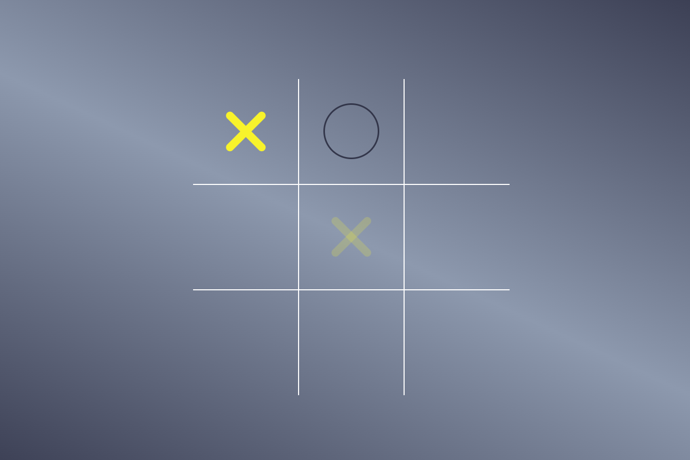

# exer_jogovelha
 Treinando com HTML5, CSS3 e JAVASCRIPT

### tela que aparecerá quando ouver uma vitória tanto do elemento X ou do circulo

### Tela de vitória do Elemento circula com o botão de reiniciar o jogo.

